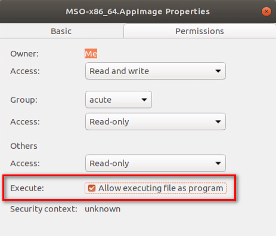

# Digital Storage Oscilloscope Desktop Application (Linux Release)

Public release of Digital Storage Oscilloscope desktop application for Acute's Digital
Storage Oscilloscope products.

**_NOTE:_** The application on Linux platform are still marked as beta versions. Please create an issue if you encounter any errors when running the program.

## Supported Models

| Types                        | Product                                       |
| ---------------------------- | --------------------------------------------- |
| Digital Storage Oscilloscope | Acute TravelScope 3000 series                 |
| Mixed Signal Oscilloscope    | Acute MSO3000 series                          |

## Supported Operating System

Ubuntu 18.04+ (Bionic Beaver)

## Download Digital Storage Oscilloscope

Download the latest version of the application from the [**Releases**](https://github.com/acute-technology-inc/tba-release/releases/latest) page.

Digital Storage Oscilloscope application is provided in an **AppImage** format, and all previous versions can also be found in the release page.

## Update Digital Storage Oscilloscope

One can update it manually by downloading the latest version of the application.

Or, you can use **AppImageUpdate** GUI tool to update the application.
Execute **AppImageUpdate-x86_64.AppImage** and select Digital_Storage_Oscilloscope-x86_64.AppImage for updating.

See also [AppImageUpdate](https://github.com/AppImageCommunity/AppImageUpdate) for more information.

## Instructions

AppImages requires making the file into executable before using it.

Check the box that says **Allow executing file as program** as shown in the image.



Or, you can type

```
    chmod a+x Digital_Storage_Oscilloscope-x86_64.AppImage
```

Simply double-click the file to launch the application after the file is changed into an executable file.

Next, the application requires udev rules to allow non-root access to Acute’s
devices. Thus, you may need to install the udev rule file that you can obtain from
`LinuxSoftwareResources.tar.gz`.

1.	Download the udev file.
2.	Type the following command in the terminal.

    ```
    sudo cp 99-AcuteUSB.rules /etc/udev/rules.d
    ```

3.	Restart PC.
4.	Launch the application.

## Troubleshooting

See [Troubleshooting guide](TROUBLESHOOTING.md) if you encounter any issues regarding the application.

